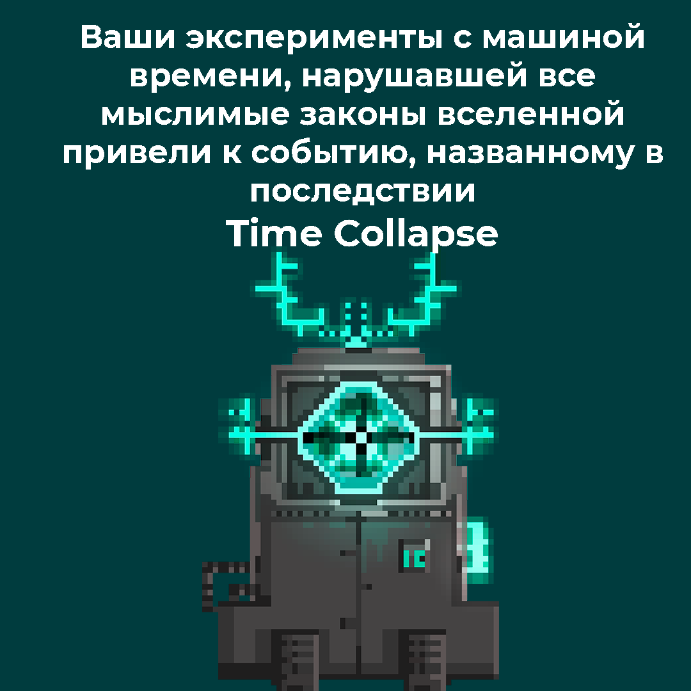
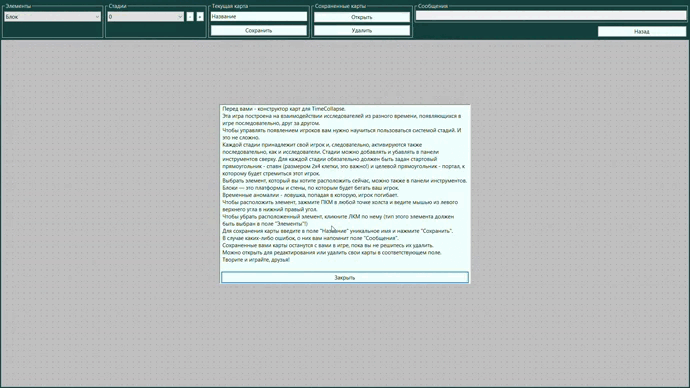
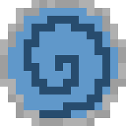

<h1 align="center">TimeCollapse</h1>

---

---

## Описание

История о крахе человеческой личности на фоне рукотворного апокалипсиса. Технофобия и нравственный аспект путешествий во
времени. Больные темы нашего поколения и многое другое может быть раскрыто в моей игре. Жаль она еще не окончена. Но
готова для вашей оценки!

_Разработка проекта не окончена и в данный момент заморожена._

<table>
    <tr>
        <td></td>
        <td></td>
    </tr>
    <tr>
        <td></td>
        <td></td>
    </tr>
    <tr>
        <td></td>
        <td></td>
    </tr>
    <tr>
        <td></td>
    </tr>
</table>

[Архив со скомпилированной игрой](https://drive.google.com/u/0/uc?id=1nUFhOw8-hxOiX0JBgBzsGQOb24Q5h-pP&export=download)

[Видеодемонстрация на Youtube](https://www.youtube.com/watch?v=5D15zuV9Ppk&ab_channel=angstorm)

[Визитка игры для конкурса](https://vk.com/wall-198416617_112)

## Демонстрация

### Игра

<a href="https://youtu.be/5D15zuV9Ppk">
    <figure>
        
        <figcaption>https://youtu.be/5D15zuV9Ppk</figcaption>
    </figure>
</a>

### Конструктор

<a href="https://youtu.be/5D15zuV9Ppk?t=60">
    <figure>
        
        <figcaption>https://youtu.be/5D15zuV9Ppk?t=60</figcaption>
    </figure>
</a>

## О проекте

Игра представляет из себя платформер в фантастическом сеттинге: мире, где люди (исследователи) разработали костюм для
перемещения во времени (детали мира, сюжета и цели игры в процессе разработки). Базовая игровая механика: передвижение и
прыжки по платформам, решение простых головоломок с использованием кнопок, движущихся платформ и прочего (в процессе
разработки).

Уникальная механика: Взаимодействие персонажа с собой из прошлого. Нельзя попадаться своему двойнику (тройнику и т.д.)
на глаза, но необходимо достигнуть цели уровня. Для решения некоторых задач необходимо будет заставлять копии персонажа
из разных времен рабоать сообща.

Для разнообразия уровней возможны различные дополнительные условия на них, например, туман
(сужает обзор игрока и копий, что дает преимущества и недостатки при игре).

<table>
    <tr>
        <td></td>
        <td></td>
        <td></td>
    </tr>
    <tr>
        <td>Персонаж</td>
        <td>Аномалия</td>
        <td>Портал</td>
    </tr>
</table>

Структура проекта:

- __TimeCollapse.Models__ - _Буква M в MVC - Model. Здесь описаны классы игровых сущностей. По сути вся игра, если ей не
  надо отображаться и управляться, может происходить здесь._
- __TimeCollapse.View__ - _Буквы V и C в MVC - View и Controller. Такое объединение обусловлено устройством Windows
  Forms. Здесь находится весь код, ответственный за отображение и управление игрой, а также код конструктора карт._
- __TimeCollapse.Models.Tests__ - _Unit-тесты модели игры_

## Запуск

Скачать [архив со скомпилированной игрой](https://drive.google.com/u/0/uc?id=1nUFhOw8-hxOiX0JBgBzsGQOb24Q5h-pP&export=download)
. Локально установить шрифт из архива. Запустить игру.

_либо_

Клонировать репозиторий на локальную машину. Program.cs находится в TimeCollapse.View. Скомпилилровать и запустить.

